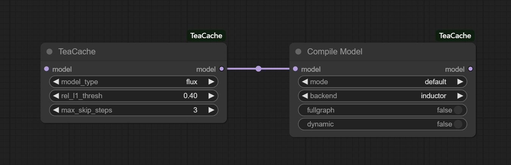

# ComfyUI-TeaCache

## Introduction
Timestep Embedding Aware Cache ([TeaCache](https://github.com/ali-vilab/TeaCache)) is a training-free caching approach that estimates and leverages the fluctuating differences among model outputs across timesteps, thereby accelerating the inference. TeaCache works well for Image Diffusion models, Video Diffusion Models, and Audio Diffusion Models.

TeaCache has now been integrated into ComfyUI and is compatible with the ComfyUI native nodes. ComfyUI-TeaCache is easy to use, simply connect the TeaCache node with the ComfyUI native nodes for seamless usage.

## Updates
- Jul 11 2025: ComfyUI-TeaCache supports FLUX-Kontext:
    - It can achieve a 1.5x lossless speedup and a 2x speedup without much visual quality degradation for FLUX-Kontext.
    - Support FLUX-Kontext LoRA!
- Jun 22 2025: ComfyUI-TeaCache supports HiDream-I1-Fast:
    - It can achieve a 1.4x lossless speedup and a 1.7x speedup without much visual quality degradation for HiDream-I1-Fast.
    - Support HiDream-I1-Fast LoRA!
- Jun 15 2025: ComfyUI-TeaCache supports HiDream-I1-Dev and Lumina-Image-2.0, adds cache_device option:
    - It can achieve a 1.5x lossless speedup and a 2x speedup without much visual quality degradation for HiDream-I1-Dev.
    - Support HiDream-I1-Dev LoRA!
    - It can achieve a 1.5x lossless speedup and a 1.7x speedup without much visual quality degradation for Lumina-Image-2.0.
    - Support Lumina-Image-2.0 LoRA!
    - Add cache_device option according to the feedback from [3](https://github.com/welltop-cn/ComfyUI-TeaCache/issues/74), [4](https://github.com/welltop-cn/ComfyUI-TeaCache/issues/104) and [5](https://github.com/welltop-cn/ComfyUI-TeaCache/issues/143).
- May 22 2025: ComfyUI-TeaCache supports HiDream-I1-Full and redesigns TeaCache options:
    - It can achieve a 1.5x lossless speedup and a 2x speedup without much visual quality degradation.
    - Support HiDream-I1-Full LoRA!
    - Add start_percent, end_percent options and remove max_skip_steps option according to the feedback from [1](https://github.com/welltop-cn/ComfyUI-TeaCache/issues/112) and [2](https://github.com/welltop-cn/ComfyUI-TeaCache/issues/84).
    - Fix compatibility issues to match the latest official ComfyUI version.
- Mar 26 2025: ComfyUI-TeaCache supports retention mode for Wan2.1 models and HunyuanVideo I2V v2 model:
    - Retention mode for Wan2.1 models can bring faster generation and better generation quality.
    - Fixes a bug about HunyuanVideo I2V v2 model.
- Mar 10 2025: ComfyUI-TeaCache adds max_skip_steps option and has made some changes for ease of use:
    - Add max_skip_steps option to enjoy a good trade-off between quality and speed for Wan2.1 models. The best settings are shown in the usage section.
    - Merge TeaCache For Img Gen and TeaCache For Vid Gen nodes into a single TeaCache node.
    - Fix compatibility issues about HunyuanVideo and LTX-Video to match the latest official ComfyUI version.
- Mar 6 2025: ComfyUI-TeaCache supports Wan2.1:
    - It can achieve a 1.5x lossless speedup and a 2x speedup without much visual quality degradation.
    - Support Text to Video and Image to Video!
- Jan 17 2025: ComfyUI-TeaCache supports CogVideoX:
    - It can achieve a 1.5x lossless speedup and a 2x speedup without much visual quality degradation.
    - Support Text to Video and Image to Video!
    - Note that TeaCache for CogVideoX node needs to be used with kijai's ComfyUI-CogVideoXWrapper nodes.
- Jan 15 2025: Thanks [@TangYanxin](https://github.com/TangYanxin), ComfyUI-TeaCache supports PuLID-FLUX and fixes bug about rel_l1_thresh:
    - It can achieve a 1.2x lossless speedup and a 1.7x speedup without much visual quality degradation.
    - Fixes a bug about rel_l1_thresh, when there are multiple TeaCache nodes in a workflow, the rel_l1_thresh value is always the value of the last TeaCache node.
- Jan 14 2025: ComfyUI-TeaCache supports Compile Model and fixes a bug that TeaCache keeps forever even if we remove/bypass the node:
    - Support Compile Model, now it can bring a faster inference when you add Compile Model node!
    - Fixes a bug related to usability, now we can go back to the workflow state without TeaCache if we remove/bypass TeaCache node.
- Jan 13 2025: Thanks [@TangYanxin](https://github.com/TangYanxin), ComfyUI-TeaCache remove the Steps setting from the node:
    - Now, it works fine even if there are multiple sampling nodes with different sampling steps in the workflow.
    - Fixes a bug, RuntimeError: The size of tensor a must match the size of tensor b at non-singleton dimension.
- Jan 10 2025: ComfyUI-TeaCache supports LTX-Video:
    - It can achieve a 1.4x lossless speedup and a 1.7x speedup without much visual quality degradation.
    - Support Text to Video and Image to Video!
- Jan 9 2025: ComfyUI-TeaCache supports HunyuanVideo:
    - It can achieve a 1.6x lossless speedup and a 2x speedup without much visual quality degradation.
- Jan 8 2025: ComfyUI-TeaCache supports FLUX:
    - It can achieve a 1.4x lossless speedup and a 2x speedup without much visual quality degradation.
    - Support FLUX LoRA!
    - Support FLUX ControlNet!

## Installation
Installation via ComfyUI-Manager is preferred. Simply search for ComfyUI-TeaCache in the list of nodes and click install.
### Manual installation
1. Go to comfyUI custom_nodes folder, `ComfyUI/custom_nodes/`
2. git clone https://github.com/welltop-cn/ComfyUI-TeaCache.git
3. Go to ComfyUI-TeaCache folder, `cd ComfyUI-TeaCache/`
4. pip install -r requirements.txt

## Usage
### TeaCache
To use TeaCache node, simply add `TeaCache` node to your workflow after `Load Diffusion Model` node or `Load LoRA` node (if you need LoRA). Generally, TeaCache can achieve a speedup of 1.5x to 3x with acceptable visual quality loss. The following table gives the recommended rel_l1_thresh, start_percent and end_percent ​for different models:

| Models                       |   rel_l1_thresh   |    start_percent  |     end_percent   |      speedup      |
|:----------------------------:|:-----------------:|:-----------------:|:-----------------:|:-----------------:|
| FLUX                         |        0.4        |         0         |         1         |        ~2x        |
| PuLID-FLUX                   |        0.4        |         0         |         1         |        ~1.7x      |
| FLUX-Kontext                 |        0.22       |         0.2       |         1         |        ~2x        |
| HiDream-I1-Full              |        0.35       |         0.1       |         1         |        ~2x        |
| HiDream-I1-Dev               |        1          |         0         |         1         |        ~2x        |
| HiDream-I1-Fast              |        1.5        |         0         |         0.9       |        ~1.7x      |
| Lumina-Image-2.0             |        0.38       |         0.2       |         1         |        ~1.7x      |
| HunyuanVideo                 |        0.15       |         0         |         1         |        ~1.9x      |
| LTX-Video                    |        0.06       |         0         |         1         |        ~1.7x      |
| CogVideoX                    |        0.3        |         0         |         1         |        ~2x        |
| Wan2.1-T2V-1.3B              |        0.08       |         0         |         1         |        ~1.6x      |
| Wan2.1-T2V-14B               |        0.2        |         0         |         1         |        ~1.8x      |
| Wan2.1-I2V-480P-14B          |        0.26       |         0         |         1         |        ~1.9x      |
| Wan2.1-I2V-720P-14B          |        0.25       |         0         |         1         |        ~1.6x      |
| Wan2.1-T2V-1.3B-ret-mode     |        0.15       |         0.1       |         1         |        ~2.2x      |
| Wan2.1-T2V-14B-ret-mode      |        0.2        |         0.1       |         1         |        ~2.1x      |
| Wan2.1-I2V-480P-14B-ret-mode |        0.3        |         0.1       |         1         |        ~2.3x      |
| Wan2.1-I2V-720P-14B-ret-mode |        0.3        |         0.1       |         1         |        ~2x        |

If the image/video after applying TeaCache is of low quality, please reduce rel_l1_thresh. I really don't recommend adjusting start_percent and end_percent unless you are an experienced engineer or creator.

If you have enough VRAM, please select `cuda` in the `cache_device` option, which can bring faster inference, but will increase VRAM slightly. If you have limited VRAM, please select `cpu` in the `cache_device` option, which do not increase VRAM, but will make inference slower slightly.

The demo workflows ([flux](./examples/flux.json), [pulid_flux](./examples/pulid_flux.json), [flux_kontext](./examples/flux_kontext.json), [hidream_i1_full](./examples/hidream_i1_full.json), [hidream_i1_dev](./examples/hidream_i1_dev.json), [hidream_i1_fast](./examples/hidream_i1_fast.json), [lumina_image_2](./examples/lumina_image_2.json), [hunyuanvideo](./examples/hunyuanvideo.json), [ltx_video](./examples/ltx_video.json), [cogvideox](./examples/cogvideox.json), [wan2.1_t2v](./examples/wan2.1_t2v.json) and [wan2.1_i2v](./examples/wan2.1_i2v.json)) are placed in examples folder.

### Compile Model
To use Compile Model node, simply add `Compile Model` node to your workflow after `Load Diffusion Model` node or `TeaCache` node. Compile Model uses `torch.compile` to enhance the model performance by compiling model into more efficient intermediate representations (IRs). This compilation process leverages backend compilers to generate optimized code, which can significantly speed up inference. The compilation may take long time when you run the workflow at first, but once it is compiled, inference is extremely fast. The usage is shown below:

## Result comparison
- 
<strong>FLUX</strong>

- 
<strong>PuLID-FLUX</strong>

- 
<strong>FLUX-Kontext</strong>

- 
<strong>HiDream-I1-Full</strong>

- 
<strong>HiDream-I1-Dev</strong>

- 
<strong>HiDream-I1-Fast</strong>

- 
<strong>Lumina-Image-2.0</strong>

- 
<strong>HunyuanVideo</strong>

https://github.com/user-attachments/assets/b3aca64d-c2ae-440c-a362-f3a7b6c633e0

- 
<strong>LTX-Video</strong>

https://github.com/user-attachments/assets/8fce9b48-2243-46f1-b411-80e4a53f6f7d

- 
<strong>CogVideoX</strong>

https://github.com/user-attachments/assets/de8f5400-e885-446d-936f-c026a78ba5c2

- 
<strong>Wan2.1-T2V</strong>

https://github.com/user-attachments/assets/8a84a862-1947-4ba8-8298-047d50d8f670

- 
<strong>Wan2.1-I2V</strong>

https://github.com/user-attachments/assets/0ed5c2c6-b749-41cb-9e2b-e152ecd6c7c1

## Acknowledgments
Thanks to TeaCache repo owner [ali-vilab/TeaCache: Timestep Embedding Tells: It's Time to Cache for Video Diffusion Model](https://github.com/ali-vilab/TeaCache)
